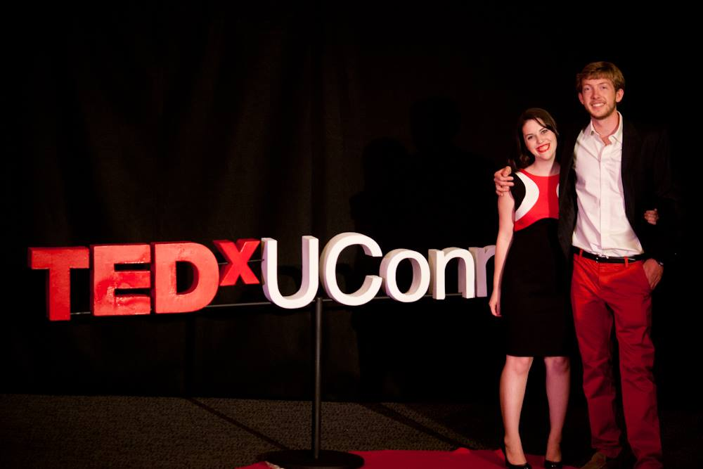

 

 

Rose, shown here with TEDxUConn President and co-host David Ritter, curates and co-hosts TEDxUConn 2013: Future in Focus.

 

Videos from the event are available on <a href="https://www.youtube.com/playlist?list=PLsRNoUx8w3rNRhNvhTVZsKaSqiOdVokpF" target="_blank">Youtube</a> and include talks from Wendell Wallach, Anish Bhimani, Cato, Laurencin, Veda Partalo, Regina Barreca, and many more!

