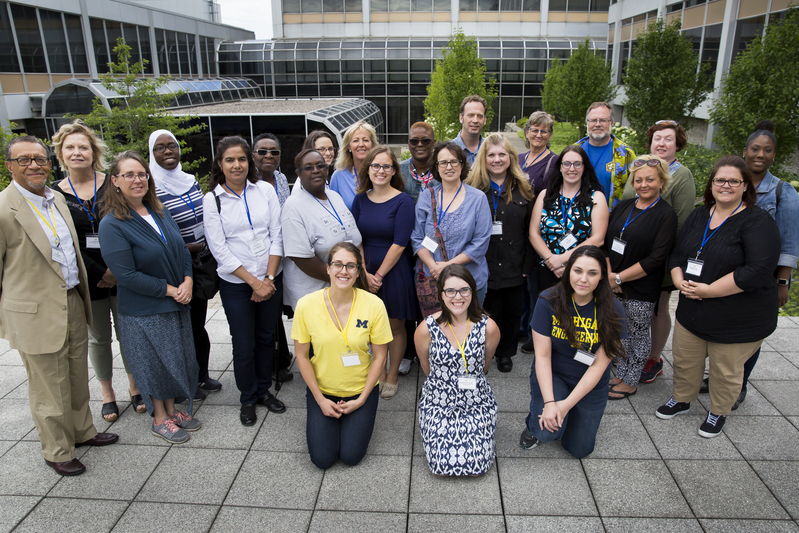

Rose hosts the inaugural workshop "Research Education and Activities for Classroom Teachers" (<a href="https://macro.engin.umich.edu/react-workshop/" target="_blank">{{"REACT"}}</a>), bringing 19 teachers from across Michigan to interact with UM research. This event is covered by the Center for Educational Outreach: "<a href="https://ceo.umich.edu/2017/06/27/u-m-graduate-students-react/" target="_blank">{{"UM Graduate Students REACT"}}</a>", with additional photos found <a href="https://www.flickr.com/photos/michigan-engineering/sets/72157685544866395" target="_blank">{{"here"}}</a>.
 

