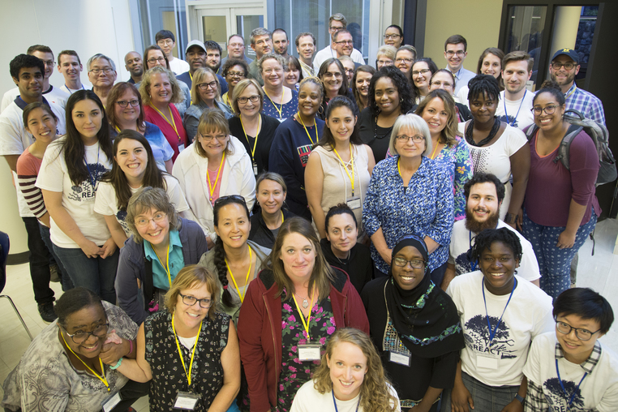

Rose hosts 53 teachers to UM campus to experience UM research for the second annual <a href="https://macro.engin.umich.edu/react-workshop/" target="_blank">{{"REACT workshop"}}</a>, with participation spanning across 10 departments and including over 30 volunteers. The Michigan Engineer writes "<a href="https://news.engin.umich.edu/2018/08/stem-education-a-taste-of-research-for-k-12-teachers/" target="_blank">{{"STEM education: A taste of research for K-12 teachers"}}</a>" detailing the event, with additional images at <a.

 

 REACT has made all workshop materials (videos and lesson plans) available on <a href="https://macro.engin.umich.edu/react-workshop/past-content/" target="_blank">{{"the REACT webpage"}}</a> and <a href="https://www.youtube.com/watch?v=16EY1MGTH4I&list=PL9aE-7MDTB3_gGIp2wmnaWspduhAIleWF" target="_blank">{{"YouTube"}}</a>.
 
